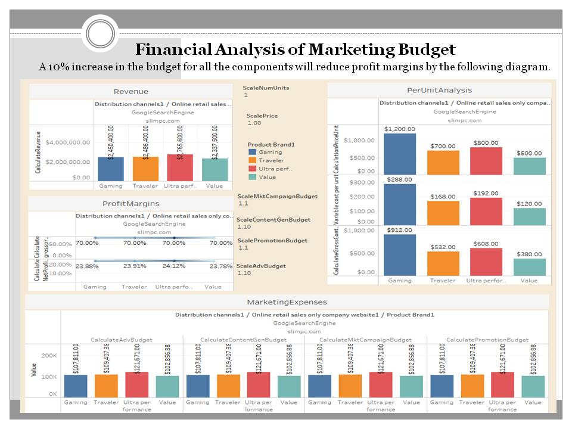
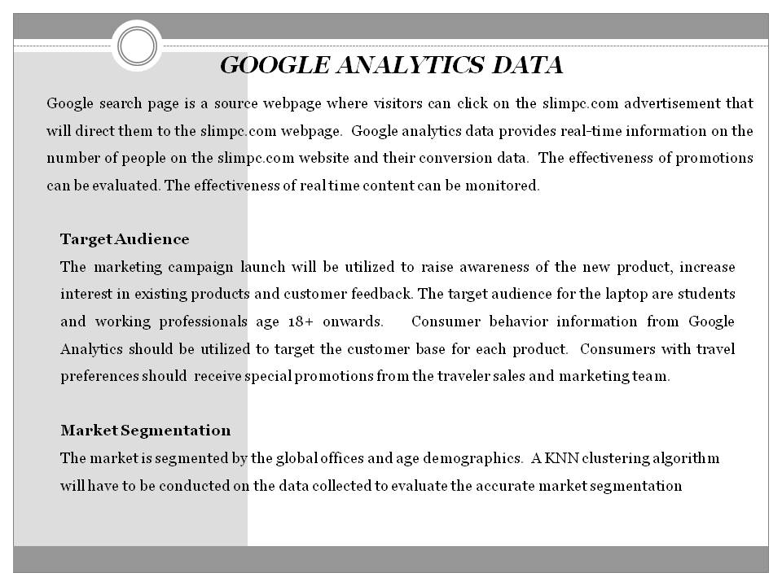

# MBA Capstone

The project utilizes a demo google analytics account. This data can be uitlized to understand how leads are generated, which content maximizes revenue and the NPV analysis of the marketing campaign. 
Review digital transformation in e-commerce and modern technologies such as "AI & ChatGPT Prompt for Digital Marketing Sales and Growth"
in progress... my sincerest apologies, please allow me to resolve the problem...OK

