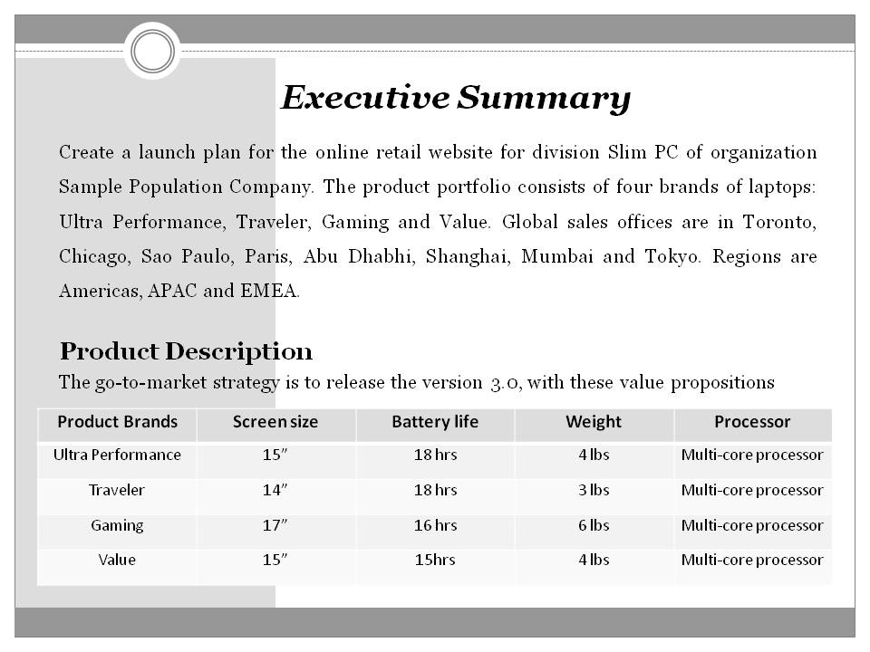

# MBA Capstone - Launch Plan

The project focuses on ecommerce, digital marketing and how data science can be utilized efficiently to understand how leads are generated, which content maximizes revenue and the NPV analysis of the marketing campaign with the help of google analytics. Goal is to create an effective  pre-launch, launch and post-launch plan for online retail focused on four SlimPC products - Ultraperformance, traveler, Workstation and Value PC brands with global sales offices in Toronto, Chicago, Sao Paulo, Paris, Abu Dhabhi, Shanghai, Mumbai and Tokyo. 

